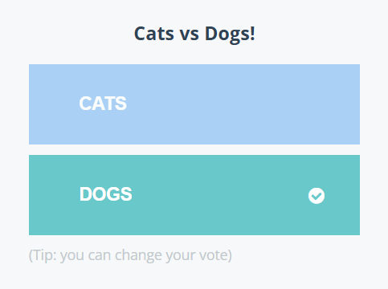
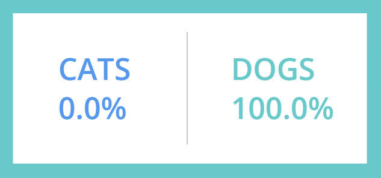

# Kubernetes-voting-app Pod Version
The voting application 

## Architecture
This simple system contains 5 ``pods`` and 4 ``services``

Pods: vote, result, redis, db, worker

Services: vote-service, result-servie, redis-service, db-service

`services` connect two components of the applicatiom:
- The vote frontend needs to talk to redis. Instead of hardcoding a pod IP (which changes constantly), it just sends requests to redis-service.
- Kubernetes then automatically routes that request to one of the running redis pods.

`worker` isn’t a Service because it doesn’t need incoming traffic. It’s a “background engine” that just processes jobs in the queue:
- The vote frontend takes user votes and pushes them into Redis (a fast in-memory queue).
- The worker constantly watches that Redis queue, picks up votes, and writes them into the Postgres DB.
- It’s essentially the bridge between Redis and Postgres.

So:
Frontend (vote) → pushes vote into Redis
Worker → pulls vote from Redis → saves to DB


## Create Pods:
Command:
```
kubectl create -f .
```
Output:
```
pod/database created
service/db created
pod/redis created
service/redis created
pod/result created
service/result created
pod/vote created
service/vote created
pod/worker created
```

## Verify that they are up and running: 
Command
```
kubectl get pods
```

Output:
```
NAME       READY   STATUS              RESTARTS   AGE
result     0/1     ContainerCreating   0          8s
database   0/1     ContainerCreating   0          8s
vote       0/1     ContainerCreating   0          8s
redis      0/1     ContainerCreating   0          8s
worker     0/1     ContainerCreating   0          8s
```
After some time:
```
NAME       READY   STATUS    RESTARTS   AGE
result     1/1     Running   0          2m49s
database   1/1     Running   0          2m49s
vote       1/1     Running   0          2m49s
redis      1/1     Running   0          2m49s
worker     1/1     Running   0          2m49s
```

## Accessing the UI (minikube)
Locally I am only running on `minikube` to keep setup easy. To access UI you need to set up a tunnel so the easiest was to see your UI is the following command:
```
minikube service vote
minikube service result
```
Note: They will need to be in two separate terminals

Then you will see the two tabs with both sections of the UI:



## Accessing the UI (production)
While I have not completed this step myself as I am only using `minikube` the setup for production for this voter application would be as follows:

In a production environment (e.g., AWS EKS, GCP GKE, or Azure AKS), your services will typically be of type ``LoadBalancer`` rather than ``NodePort``. This allows the cloud provider to automatically provision an external load balancer and assign a public IP that routes traffic into your cluster.

Command:
```
kubectl get services
```
Output:
```
NAME         TYPE        CLUSTER-IP       EXTERNAL-IP   PORT(S)          AGE
result       NodePort    10.100.109.235   <none>        8081:31001/TCP   3m54s
db           ClusterIP   10.109.82.42     <none>        5432/TCP         3m54s
vote         NodePort    10.103.33.210    <none>        8080:31000/TCP   3m54s
kubernetes   ClusterIP   10.96.0.1        <none>        443/TCP          47h
redis        ClusterIP   10.101.75.62     <none>        6379/TCP         3m54s
```
We can see here that frontend is of Type `NodePort`, which is necessary to be accessible from outside the cluster. The node is running on port ``31000`` and passes requests to port ``80`` on the ``pod``. 


Once the external IPs are assigned (which may take a few minutes), you can access the applications directly using those IPs:

```
http://34.122.18.95:8080     # Vote UI
http://34.122.18.94:8081     # Result UI
```

If your cluster uses NodePort instead of LoadBalancer, you can still access the app through the node’s public IP:

```
http://<NODE_PUBLIC_IP>:31000   # Vote UI
http://<NODE_PUBLIC_IP>:31001   # Result UI
```